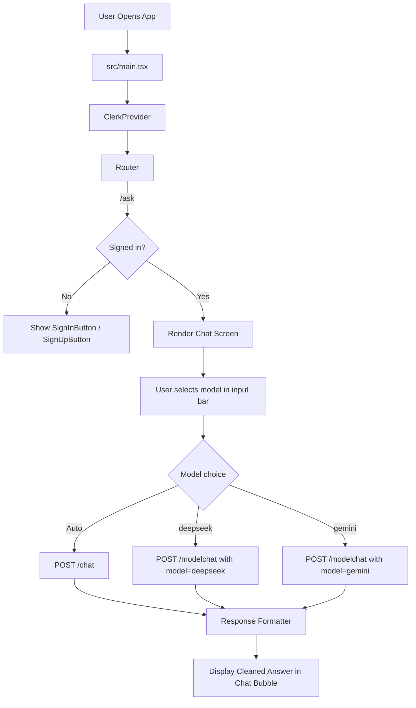

# 🏛️ Nyayagpt

An AI-powered legal chatbot providing expert guidance on Indian law, constitution, and legal concepts. Built with modern web technologies and beautiful interactive UI animations.

**Live Demo**: [Visit Nyayagpt](https://nyayagptbot.vercel.app)

---

## 📌 Latest Updates (April 2026)

This project now includes:

- **Clerk Authentication** integrated at app root with route-level protection for chat.
- **Protected Chat Route**: `/ask` is accessible only to signed-in users.
- **Model-Based Chat Routing** in the chat input:
   - `Auto (/chat)` routes to `/chat`
   - `deepseek` routes to `/modelchat`
   - `gemini` routes to `/modelchat`
- **Mobile-Optimized Input Bar**:
   - Single attachment icon
   - Single model-selection icon

### Environment Variables (Current)

Use `.env.local` for local development (preferred), or `.env`:

```bash
VITE_LEGAL_CHAT_API_BASE_URL=https://yourbaseurl.com
VITE_CLERK_PUBLISHABLE_KEY=YOUR_PUBLISHABLE_KEY
```

> Clerk React Quickstart: https://clerk.com/docs/react/getting-started/quickstart

### Request Flow Diagram



---

## ✨ Features

- **Intelligent Legal Chatbot** - Get answers to questions about Indian law, constitution, fundamental rights, and legal procedures
- **Modern UI/UX** - Beautifully crafted interface with smooth animations and interactive elements
- **Real-time Chat** - Stream-based responses for seamless conversation
- **Multi-language Support** - Built-in language context system for international audiences
- **Dark/Light Theme** - Responsive design that adapts to user preferences
- **Advanced Animations** - Custom animations including gravity effects, pixel transitions, and more
- **Mobile Responsive** - Fully responsive design for all devices

---

## 🛠️ Tech Stack

### Frontend
- **React 18.3** - UI library
- **TypeScript** - Type-safe JavaScript
- **Vite 6** - Lightning-fast build tool
- **React Router 7** - Client-side routing
- **Tailwind CSS 4** - Utility-first CSS framework

### UI & Components
- **Radix UI** - Unstyled, accessible component library
- **Material-UI** - Design system components
- **Lucide React** - Beautiful icon library

### Animation & Graphics
- **GSAP 3** - Professional animation library
- **Three.js** - 3D graphics library
- **OGL** - WebGL library for graphics
- **Motion** - Animation primitives
- **Canvas Confetti** - Particle animation effects
- **PostProcessing** - Post-processing effects for Three.js

### Utilities
- **React Hook Form** - Performant form handling
- **React Day Picker** - Calendar component
- **React DnD** - Drag and drop library
- **React Slick** - Carousel component
- **Recharts** - Charting library
- **Sonner** - Toast notifications
- **Vaul** - Drawer component
- **MathJS** - Math computation

---

## 📁 Project Structure

```
src/
├── app/
│   ├── components/          # Reusable UI components
│   │   ├── ui/             # Radix UI based components
│   │   ├── figma/          # Figma-specific components
│   │   └── [Component].tsx # Custom components (Hero, Navbar, etc.)
│   ├── pages/              # Page components
│   │   ├── Home.tsx
│   │   ├── Chat.tsx
│   │   ├── About.tsx
│   │   ├── Blog.tsx
│   │   ├── HowItWorks.tsx
│   │   └── FeaturesPage.tsx
│   ├── context/            # React Context
│   │   └── LanguageContext.tsx
│   ├── App.tsx             # Main app component
│   └── nyayabot.css        # Global styles
├── lib/
│   └── api.ts              # API integration
├── styles/                 # Global stylesheets
│   ├── fonts.css
│   ├── theme.css
│   ├── tailwind.css
│   └── index.css
├── imports/                # Imported assets
│   └── pasted_text/        # Pasted components and assets
├── main.tsx                # React entry point
└── vite-env.d.ts          # Vite type definitions
```

---

## 🚀 Getting Started

### Prerequisites
- Node.js 16.0 or higher
- npm or your preferred package manager

### Installation

1. **Clone the repository**
   ```bash
   git clone https://github.com/akcode7/Nyayagpt.git
   cd Nyayagpt
   ```

2. **Install dependencies**
   ```bash
   npm install
   # or
   pnpm install
   ```

### Development

Start the development server:
```bash
npm run dev
```

The app will be available at `http://localhost:5173`

### Production Build

Build for production:
```bash
npm run build
```

The optimized build will be in the `dist/` directory.

---

## 📜 Available Scripts

| Script | Description |
|--------|-------------|
| `npm run dev` | Start development server with hot reload |
| `npm run build` | Build for production |

---

## 🎨 Key Components

### Pages
- **Home** - Landing page with hero section, testimonials, and CTA
- **Chat** (`/ask`) - Interactive AI chatbot interface
- **How It Works** - Educational page explaining the service
- **Features** - Detailed features showcase
- **About** - Company/project information
- **Blog** - Blog articles and resources

### Visual Effects Components
- **Hero** - Landing page hero section
- **CustomCursor** - Custom cursor with interactions
- **ClickSpark** - Particle effect on click
- **PixelBlast** - Pixel-based animation effect
- **PixelTransition** - Transition effect with pixels
- **GravityStars** - Gravity-based star animation
- **TrueFocus** - Focus/blur effect
- **VariableProximity** - Proximity-based interactions
- **ScrollVelocity** - Velocity-based scroll animations
- **BorderGlow** - Glowing border effect

---

## 🔌 API Integration

The app integrates with a backend API for chat functionality. The main API endpoint is defined in `src/lib/api.ts`:

```typescript
// Example chat stream function
chatStream(userMessage: string, onChunk: (chunk: string) => void)
```

---

## 🌐 Deployment

### Vercel (Recommended)

This project is configured for Vercel deployment with the `vercel.json` file:

```bash
# Deploy to Vercel
npm install -g vercel
vercel
```

The app will be automatically deployed at `https://nyayagpt.vercel.app`

---

## 🎯 Features in Detail

### Chat Interface
- **Real-time Streaming** - Responses stream in real-time for better UX
- **Message History** - Keep track of conversation context
- **Suggestions** - Pre-built suggestions for common legal questions
- **Dark Theme** - Specialized dark theme for the chat page
- **Timestamp** - Each message includes a timestamp

### Legal Knowledge Base
The chatbot specializes in:
- Indian Constitution and Articles
- Fundamental Rights & Directive Principles
- Right to Information (RTI) Act
- Public Interest Litigation (PIL)
- And more legal concepts

---

## 🛣️ Roadmap

- [ ] Multi-language support completion
- [ ] Offline functionality with service workers
- [ ] Advanced search in chat history
- [ ] Legal document upload and analysis
- [ ] Citation and source references
- [ ] Legal templates and forms

---

## 🤝 Contributing

Contributions are welcome! Please feel free to submit a Pull Request.

1. Fork the repository
2. Create your feature branch (`git checkout -b feature/AmazingFeature`)
3. Commit your changes (`git commit -m 'Add some AmazingFeature'`)
4. Push to the branch (`git push origin feature/AmazingFeature`)
5. Open a Pull Request

---

## 📄 License

This project is licensed under the MIT License - see the LICENSE file for details.

---

## 👨‍💻 Author

**akcode7**

---

## 📞 Support

For support, questions, or feedback, please open an issue on the GitHub repository.

---

## 🙏 Acknowledgments

- Built with [React](https://react.dev)
- Styled with [Tailwind CSS](https://tailwindcss.com)
- Animated with [GSAP](https://greensock.com/gsap)
- Deployed on [Vercel](https://vercel.com)
- Icons from [Lucide React](https://lucide.dev)

---

**Made with ❤️ for accessible legal knowledge in India**
